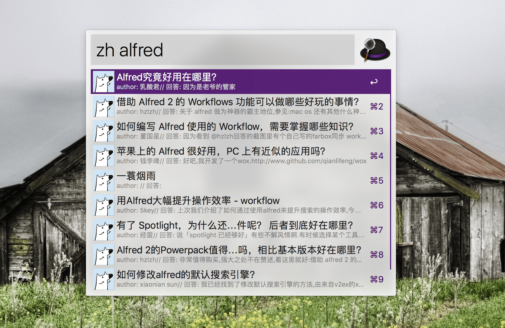

# zhihu_search_alfred_workflow
An workflow for Alfred about searching on zhihu

## Basics
开发基于 `JavaScript`, `node`,  `cheerio`, `知乎搜索`
使用平台: `Alfred`

使用: 下载 .alfredworkflow 文件, 双击运行

response 的解析依赖于开源的 [cheerio](https://github.com/cheeriojs/cheerio)

## 功能

使用 Alfred 基于关键词快捷搜索知乎平台上的问题及回答
触发 keyword: `zh`
列表 title 为每一条结果的 title
列表 subtitle 为每一条结果的 author&summary 拼接

## 预览

